# Explainable AI for CNN-Based Image Classification

This project compares two convolutional neural networks of different complexity on a 5-class subset of CIFAR-10 and analyzes their behavior with multiple explainability methods.

The workflow is implemented in a single Jupyter notebook, [explainable_ai_analysis.ipynb](./explainable_ai_analysis.ipynb), using PyTorch, Captum, and LIME.

## Overview

The notebook covers:

- dataset preparation for 5 CIFAR-10 classes: Airplane, Automobile, Bird, Cat, Deer
- training of a simple CNN and a deeper CNN
- training-curve analysis and confusion matrices
- local explainability with Grad-CAM, LIME, and RISE
- class model visualization with activation maximization

## Sample Images

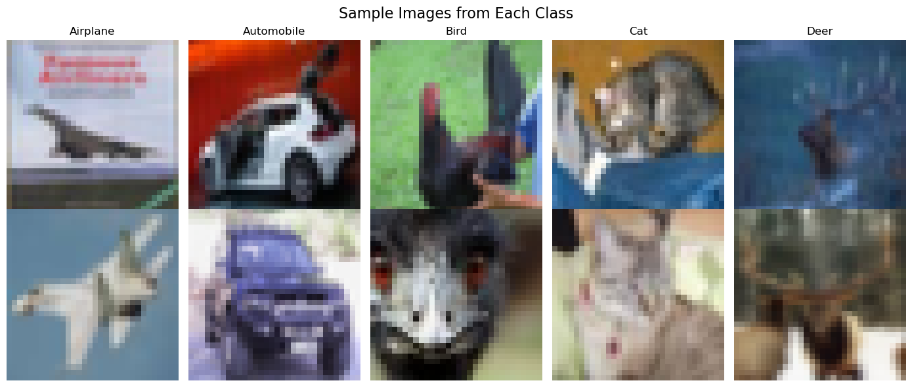

## Results

The values below come from the latest saved notebook outputs.

### Model Summary

| Metric | Simple CNN | Complex CNN |
|---|---:|---:|
| Architecture | 2 conv + 2 FC | 5 conv + 3 FC + BatchNorm + Dropout |
| Parameters | 136,549 | 3,143,941 |
| Final train accuracy | 79.4% | 85.4% |
| Notebook-reported split accuracy after 25 epochs | 80.9% | 89.5% |
| Final evaluation accuracy | 0.8092 | 0.8954 |
| Weighted precision | 0.8097 | 0.8954 |
| Weighted recall | 0.8092 | 0.8954 |
| Weighted F1-score | 0.8089 | 0.8946 |

### Per-Class Accuracy

| Class | Simple CNN | Complex CNN |
|---|---:|---:|
| Airplane | 81.3% | 92.8% |
| Automobile | 93.9% | 98.3% |
| Bird | 70.8% | 79.3% |
| Cat | 76.5% | 84.8% |
| Deer | 82.1% | 92.5% |

### Training Curves

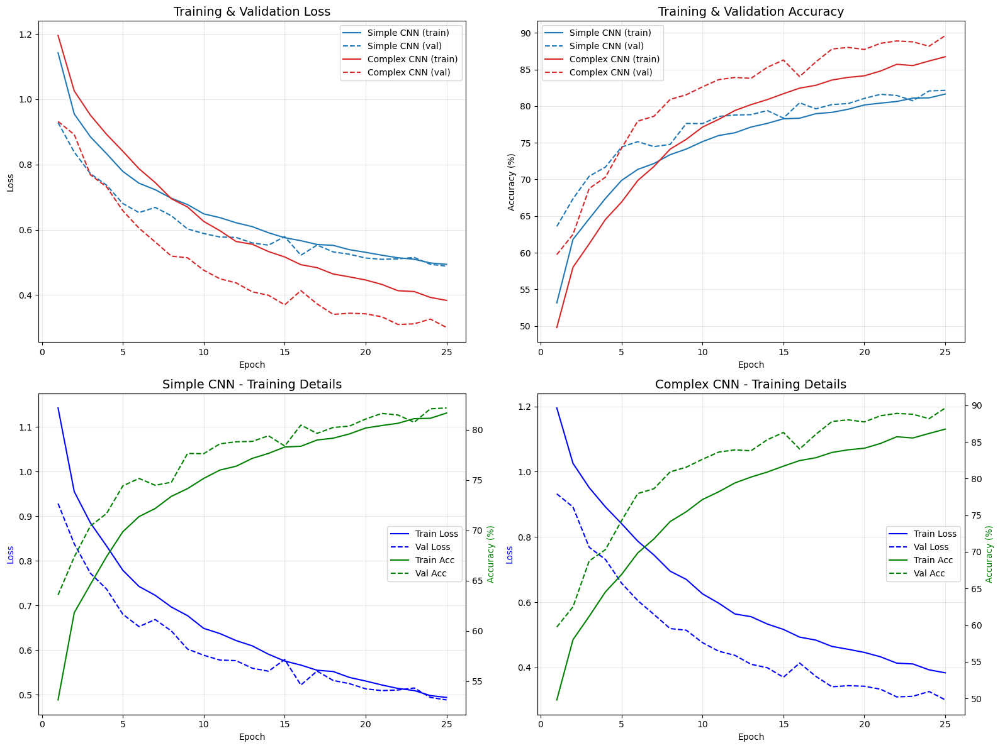

### Confusion Matrices

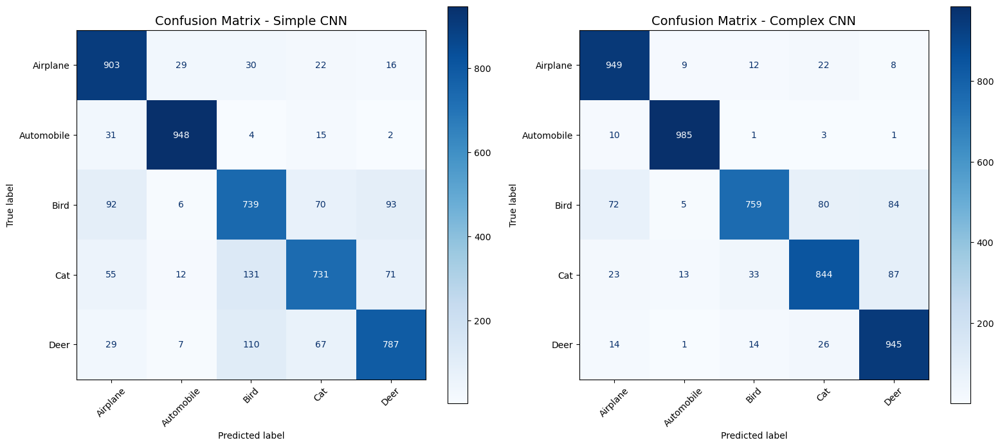

### Explainability Selection in the Current Run

The latest notebook run uses:

- 6 selected instances per model
- 5 correctly classified examples, one from each class
- 1 misclassified example for contrast

## Explainability Methods

### Grad-CAM

Gradient-based saliency from the last convolutional layer.

| Simple CNN | Complex CNN |
|:---:|:---:|
| 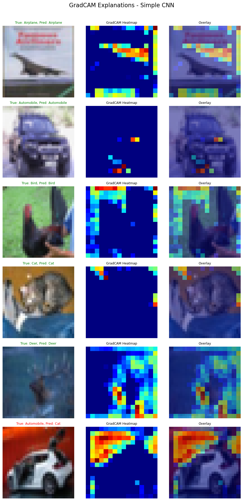 | 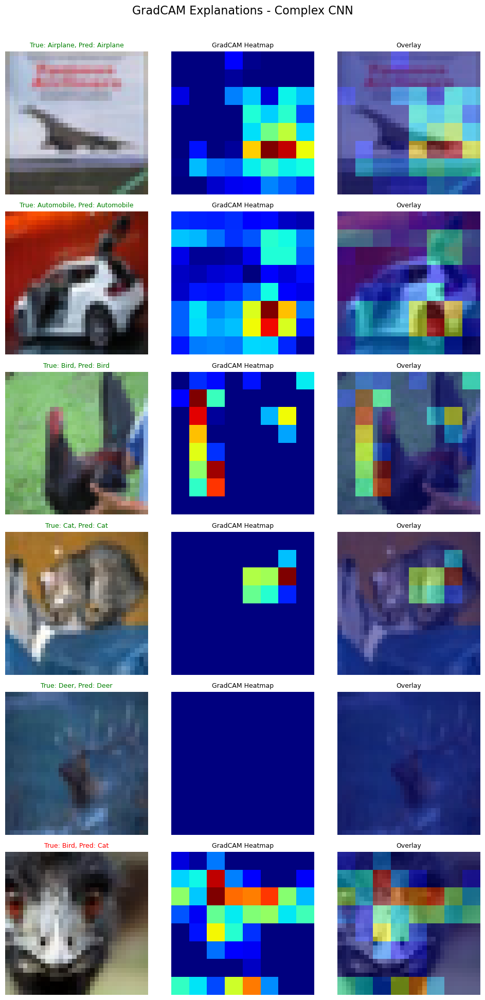 |

### LIME

Superpixel-based local explanations.

| Simple CNN | Complex CNN |
|:---:|:---:|
| 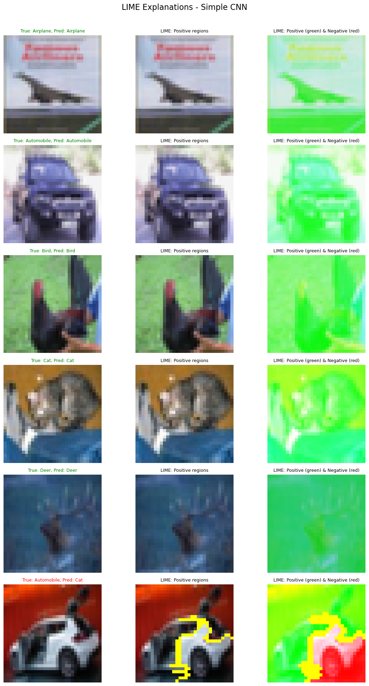 | 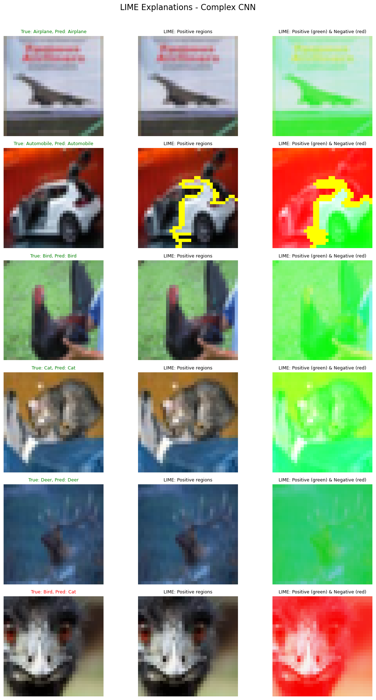 |

### RISE

Randomized mask-based saliency maps.

| Simple CNN | Complex CNN |
|:---:|:---:|
| 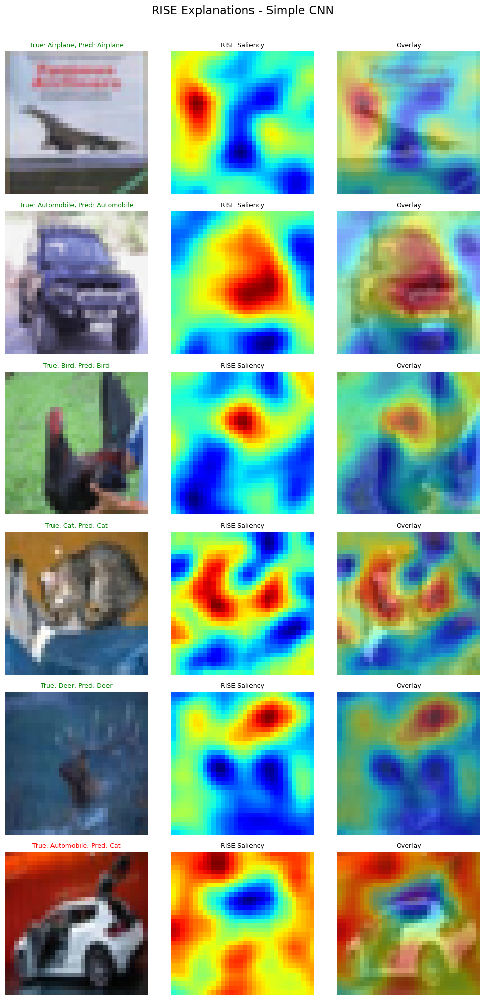 | 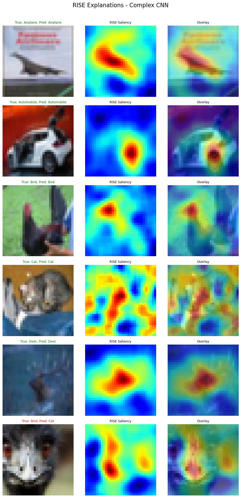 |

### Cross-Method Comparison

| Simple CNN | Complex CNN |
|:---:|:---:|
| 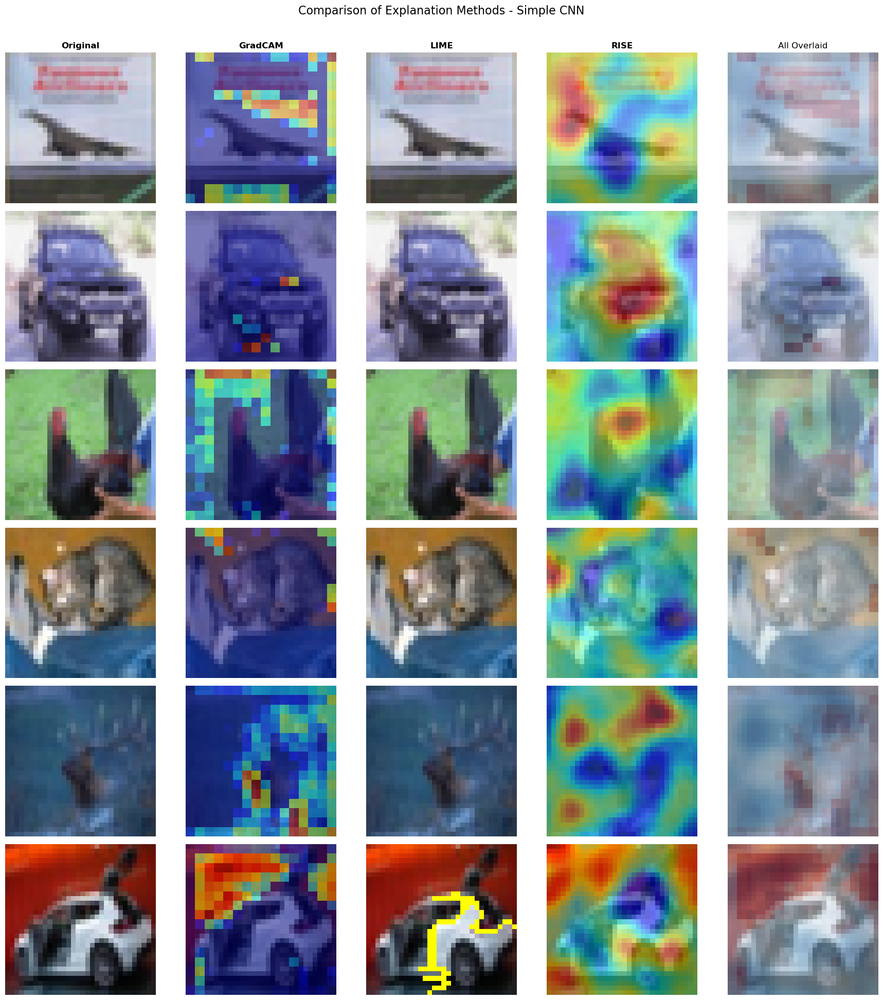 | 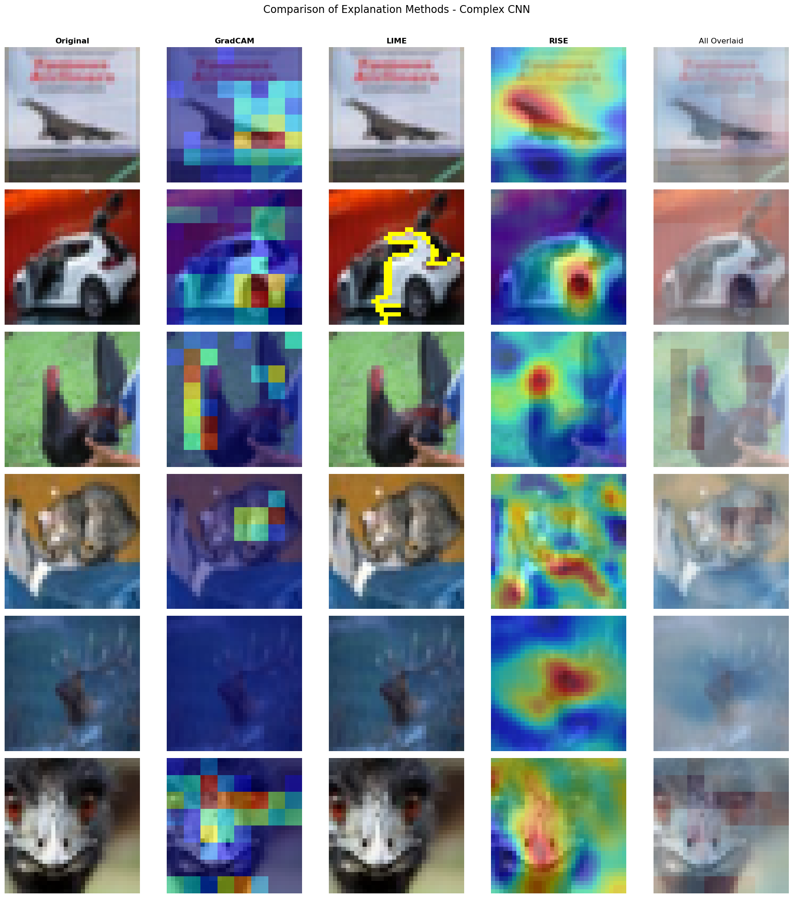 |

### Activation Maximization

Synthetic class prototypes generated by gradient ascent.

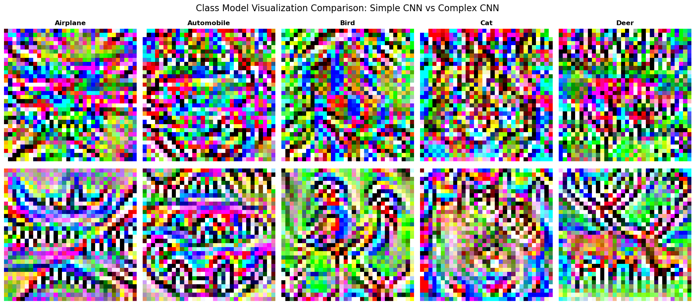

## Main Findings

- The deeper CNN performs better across every reported metric.
- The biggest class-level gains are visible on Airplane, Bird, Cat, and Deer, while Automobile is already strong in both models.
- Grad-CAM, LIME, and RISE are generally more focused and more mutually consistent for the deeper model.
- Activation maximization produces more structured class prototypes for the deeper model, while the shallow model tends to learn noisier, more texture-driven patterns.

## Dataset

The project uses a 5-class subset of CIFAR-10:

- Airplane
- Automobile
- Bird
- Cat
- Deer

Dataset properties:

- RGB images
- image size: 32x32
- training samples: 25,000
- test samples: 5,000
- approximately 5,000 training images and 1,000 test images per class

Preprocessing:

- random horizontal flip
- random crop with padding
- normalization with mean `[0.4914, 0.4822, 0.4465]`
- normalization with std `[0.2470, 0.2435, 0.2616]`

## Training Configuration

- optimizer: Adam
- learning rate: `0.001`
- loss: `CrossEntropyLoss`
- scheduler: `ReduceLROnPlateau`
- epochs: `25`
- batch size: `128`

## Requirements

- Python 3.11+
- torch
- torchvision
- captum
- lime
- scikit-learn
- scikit-image
- scipy
- matplotlib
- numpy

Install dependencies with:

```bash
pip install torch torchvision captum lime scikit-learn scikit-image scipy matplotlib numpy
```

## How to Run

Start Jupyter and open the notebook:

```bash
jupyter notebook explainable_ai_analysis.ipynb
```

Run the cells top to bottom to:

- download and filter CIFAR-10
- train both models
- compute metrics
- generate explainability plots
- generate class visualizations

## Notes and Limitations

- The notebook logs per-epoch performance on the same official CIFAR-10 test split later used for final evaluation. The tables above therefore reflect the notebook's current reporting setup rather than a strict train/validation/test separation.
- CIFAR-10 images are only 32x32, so enlarged explanation figures will naturally look low-resolution.
- The notebook does not fix deterministic random seeds, so exact numbers can vary between reruns.
- The current explainability selection was reduced to 6 instances for more compact plots. If you need a larger sample for reporting, adjust the selection logic in the notebook and rerun the explainability cells.

## Project Structure

```text
.
├── explainable_ai_analysis.ipynb
├── outputs/
│   ├── training_curves.png
│   ├── confusion_matrices.png
│   ├── gradcam_simple_cnn.png
│   ├── gradcam_complex_cnn.png
│   ├── lime_simple_cnn.png
│   ├── lime_complex_cnn.png
│   ├── rise_simple_cnn.png
│   ├── rise_complex_cnn.png
│   ├── comparison_simple_cnn.png
│   ├── comparison_complex_cnn.png
│   ├── class_vis_simple_cnn.png
│   ├── class_vis_complex_cnn.png
│   ├── class_vis_comparison.png
│   └── sample_images.png
├── data/
└── README.md
```
